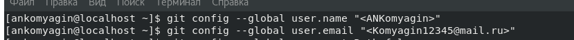

---
## Front matter
title: "Отчет по лабораторной работе №2"
subtitle: "Дисциплина: архитектура компьютера"
author: "Комягин Андрей Николаевич"

## Generic otions
lang: ru-RU
toc-title: "Содержание"

## Bibliography
bibliography: bib/cite.bib
csl: pandoc/csl/gost-r-7-0-5-2008-numeric.csl

## Pdf output format
toc: true # Table of contents
toc-depth: 2
lof: true # List of figures
lot: true # List of tables
fontsize: 12pt
linestretch: 1.5
papersize: a4
documentclass: scrreprt
## I18n polyglossia
polyglossia-lang:
  name: russian
  options:
	- spelling=modern
	- babelshorthands=true
polyglossia-otherlangs:
  name: english
## I18n babel
babel-lang: russian
babel-otherlangs: english
## Fonts
mainfont: PT Serif
romanfont: PT Serif
sansfont: PT Sans
monofont: PT Mono
mainfontoptions: Ligatures=TeX
romanfontoptions: Ligatures=TeX
sansfontoptions: Ligatures=TeX,Scale=MatchLowercase
monofontoptions: Scale=MatchLowercase,Scale=0.9
## Biblatex
biblatex: true
biblio-style: "gost-numeric"
biblatexoptions:
  - parentracker=true
  - backend=biber
  - hyperref=auto
  - language=auto
  - autolang=other*
  - citestyle=gost-numeric
## Pandoc-crossref LaTeX customization
figureTitle: "Рис."
tableTitle: "Таблица"
listingTitle: "Листинг"
lofTitle: "Список иллюстраций"
lotTitle: "Список таблиц"
lolTitle: "Листинги"
## Misc options
indent: true
header-includes:
  - \usepackage{indentfirst}
  - \usepackage{float} # keep figures where there are in the text
  - \floatplacement{figure}{H} # keep figures where there are in the text
---

# Цель работы

Целью работы является знакомство с системой управления версий git, изучение её
идеологии и приобретение практических навыков по её использованию.

# Задание

1. Создайте отчет по выполнению лабораторной работы в соответствующем каталоге
рабочего пространства (labs>lab02>report).
2. Скопируйте отчеты по выполнению предыдущих лабораторных работ в соответствую-
щие каталоги созданного рабочего пространства.
3. Загрузите файлы на github

# Теоретическое введение

: Описание некоторых каталогов файловой системы GNU Linux {#tbl:std-dir}

| Имя каталога | Описание каталога                                                                                                          |
|--------------|----------------------------------------------------------------------------------------------------------------------------|
| `/`          | Корневая директория, содержащая всю файловую                                                                               |
| `/bin `      | Основные системные утилиты, необходимые как в однопользовательском режиме, так и при обычной работе всем пользователям     |
| `/etc`       | Общесистемные конфигурационные файлы и файлы конфигурации установленных программ                                           |
| `/home`      | Содержит домашние директории пользователей, которые, в свою очередь, содержат персональные настройки и данные пользователя |
| `/media`     | Точки монтирования для сменных носителей                                                                                   |
| `/root`      | Домашняя директория пользователя  `root`                                                                                   |
| `/tmp`       | Временные файлы                                                                                                            |
| `/usr`       | Вторичная иерархия для данных пользователя                                                                                 |

Более подробно об Unix см. в [@gnu-doc:bash;@newham:2005:bash;@zarrelli:2017:bash;@robbins:2013:bash;@tannenbaum:arch-pc:ru;@tannenbaum:modern-os:ru].

# Выполнение лабораторной работы

Создаём учетную запись на сайте **GitHub** (рис. @fig:002).

{#fig:002 width=70%}

  Затем сделаем предварительную конфигурацию **git**. Откроем терминал и выполним некоторые команды.
Укажем имя и email владельца репозитория (рис. @fig:003).

{#fig:003 width=70%}

Также настроим UTF-8 в выводе сообщений git (рис. @fig:004).

{#fig:004 width=70%}

Зададим имя начальной ветки (master) (рис. @fig:005).

{#fig:005 width=70%}

Настроим параметры ядра (рис. @fig:006).

{#fig:006 width=70%}

Для идентификации пользователя на сервере сгенерируем пару  SSH ключей (рис. @fig:007).

{#fig:007 width=70%}

Скопируем ключ из локальной консоли в буфер обмена (рис. @fig:008) и загружаем его на GitHub (рис. @fig:009).

{#fig:008 width=70%}

{#fig:009 width=70%}

Создадим каталог для предмета «Архитектура компьютера» (рис. @fig:010)

{#fig:010 width=70%}

Создадим репозиторий курса на основе шаблона. Для этого перейдем на страницу репозитория с шаблоном курса https://github.com/yamadharma/course-directory-student-template. Создаём репозиторий, назвав его «study_2023–2024_arhpc» (рис. @fig:011).

{#fig:011 width=70%}

Откроем терминал, перейдём в каталог курса и клонируем только что созданный репозиторий (рис. @fig:012).

{#fig:012 width=70%}

Настроим каталог курса. Сначала перейдем в каталог курса и удалим лишние файлы (package.json) (рис. @fig:013).

{#fig:013 width=70%}

Создадим необходимые каталоги (рис. @fig:014).

{#fig:014 width=70%}

Сохраним изменения и отправим файлы на сервер (рис. @fig:015).

{#fig:015 width=70%}

Осталось убедиться в правильном создании иерархии рабочего пространства в локальном и серверном репозиториях (рис. @fig:016) и (рис. @fig:017).

{#fig:016 width=70%}

{#fig:017 width=70%}

# Выводы

B ходе работы я узнал о системе обновления версий, научился взаимодействовать с
GitHub (изменять, удалять и добавлять новые файлы) при помощи командной строки
Linux. Узнал о безопасном способе соединения с сервером, при помощи SSH ключей

# Список литературы{.unnumbered}

::: {#refs}
:::
