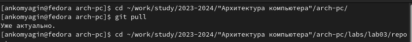
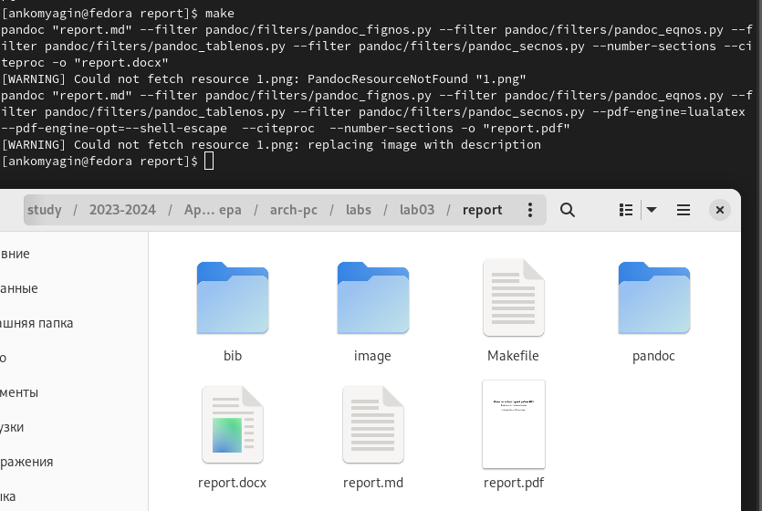
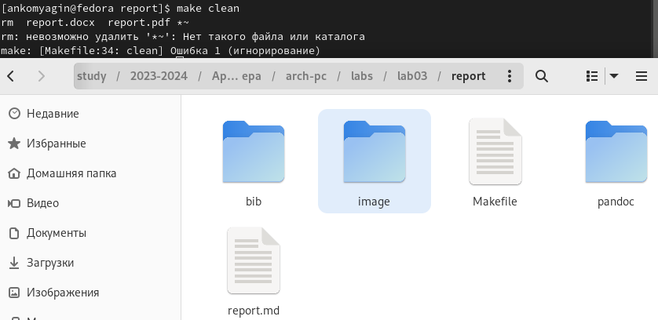
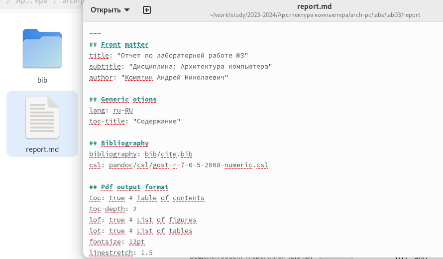
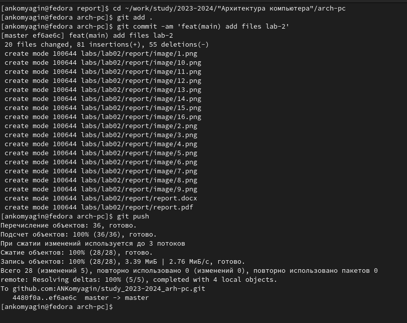
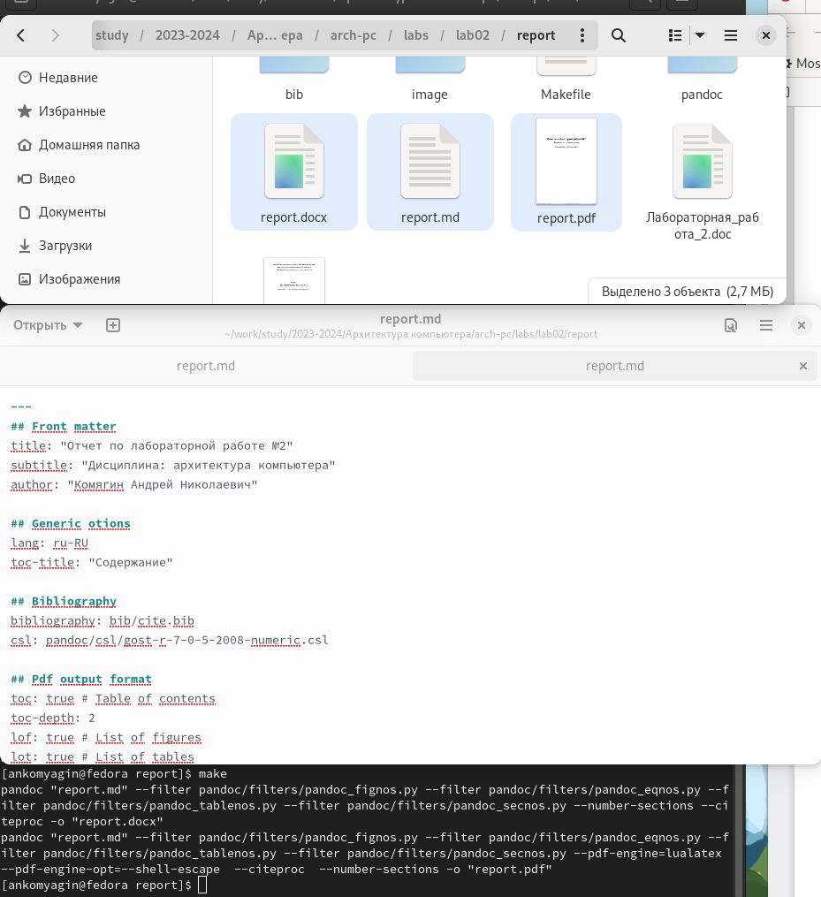
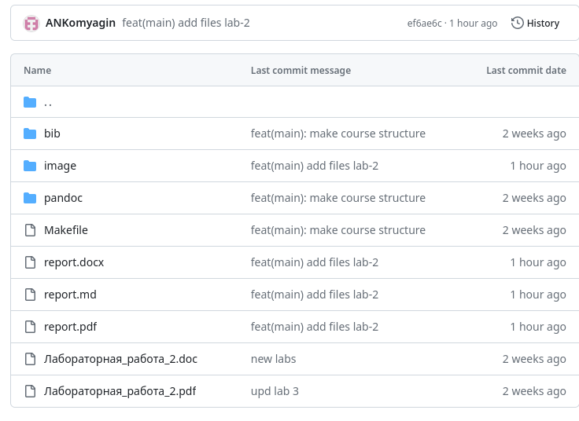

---
## Front matter
title: "Отчет по лабораторной работе №3"
subtitle: "Дисциплина: Архитектура компьютера"
author: "Комягин Андрей Николаевич"

## Generic otions
lang: ru-RU
toc-title: "Содержание"

## Bibliography
bibliography: bib/cite.bib
csl: pandoc/csl/gost-r-7-0-5-2008-numeric.csl

## Pdf output format
toc: true # Table of contents
toc-depth: 2
lof: true # List of figures
lot: true # List of tables
fontsize: 12pt
linestretch: 1.5
papersize: a4
documentclass: scrreprt
## I18n polyglossia
polyglossia-lang:
  name: russian
  options:
	- spelling=modern
	- babelshorthands=true
polyglossia-otherlangs:
  name: english
## I18n babel
babel-lang: russian
babel-otherlangs: english
## Fonts
mainfont: PT Serif
romanfont: PT Serif
sansfont: PT Sans
monofont: PT Mono
mainfontoptions: Ligatures=TeX
romanfontoptions: Ligatures=TeX
sansfontoptions: Ligatures=TeX,Scale=MatchLowercase
monofontoptions: Scale=MatchLowercase,Scale=0.9
## Biblatex
biblatex: true
biblio-style: "gost-numeric"
biblatexoptions:
  - parentracker=true
  - backend=biber
  - hyperref=auto
  - language=auto
  - autolang=other*
  - citestyle=gost-numeric
## Pandoc-crossref LaTeX customization
figureTitle: "Рис."
tableTitle: "Таблица"
listingTitle: "Листинг"
lofTitle: "Список иллюстраций"
lotTitle: "Список таблиц"
lolTitle: "Листинги"
## Misc options
indent: true
header-includes:
  - \usepackage{indentfirst}
  - \usepackage{float} # keep figures where there are in the text
  - \floatplacement{figure}{H} # keep figures where there are in the text
---

# Цель работы

Целью работы является освоение процедуры оформления отчётов с помощью легковесного языка разметки Markdown.

# Выполнение лабораторной работы

Откроем терминал, перейдем в каталог курса, обновим локальный репозиторий и перейдем в каталог с шаблоном **/lab03/report** (рис. @fig:001).

{#fig:001 width=70%}

Скомпилируем шаблон с помощью команды **make** и проверим успешность компиляции (рис. @fig:002).

{#fig:002 width=70%}

Удалим полученные файлы с помощью **Makefile** и его команды **make clean**. Проверим результат команды (рис. @fig:003).

{#fig:003 width=70%}

Откроем файл **report.md**, изучим структуру файла и заполним отчёт по третьей лабораторной работе (рис. @fig:004).

{#fig:004 width=70%}

Компилируем файл с помощью команды **make** и отправляем отчёт на **GitHub** (рис. @fig:005).

{#fig:005 width=70%}

# Задание для самостоятельной работы

1. В соответствующем каталоге сделайте отчёт по лабораторной работе №2 в формате
**Markdown**. В качестве отчёта необходимо предоставить отчёты в 3 форматах: **pdf**, **docx**
и **md**.

Будем использовать графический интерфейс. Перейдем в каталог **report** внутри папки **lab02**. Изменим содержимое отчета и скомпилируем документы. Проверим документы в папке (рис. @fig:006).

{#fig:006 width=70%}

2. Загрузите файлы на **github**.
Загрузим файлы на **GitHub**. Для этого введем последовательность команд (рис. @fig:007).

{#fig:007 width=80%}

Проверим файлы на **GitHub** (рис. @fig:008).

{#fig:008 width=80%}

# Выводы

В ходе выполнения лабораторной работы я узнал, как работать с языком разметки **Markdown**. Отработал полученные знания на практике и создал 2 отчёта по лабораторным работам. 
