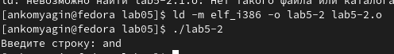

---
## Front matter
title: "Лабораторная работа №5"
subtitle: "Дисциплина: Архитектура компьютера"
author: "Комягин Андрей Николаевич"

## Generic otions
lang: ru-RU
toc-title: "Содержание"

## Bibliography
bibliography: bib/cite.bib
csl: pandoc/csl/gost-r-7-0-5-2008-numeric.csl

## Pdf output format
toc: true # Table of contents
toc-depth: 2
lof: true # List of figures
lot: true # List of tables
fontsize: 12pt
linestretch: 1.5
papersize: a4
documentclass: scrreprt
## I18n polyglossia
polyglossia-lang:
  name: russian
  options:
	- spelling=modern
	- babelshorthands=true
polyglossia-otherlangs:
  name: english
## I18n babel
babel-lang: russian
babel-otherlangs: english
## Fonts
mainfont: PT Serif
romanfont: PT Serif
sansfont: PT Sans
monofont: PT Mono
mainfontoptions: Ligatures=TeX
romanfontoptions: Ligatures=TeX
sansfontoptions: Ligatures=TeX,Scale=MatchLowercase
monofontoptions: Scale=MatchLowercase,Scale=0.9
## Biblatex
biblatex: true
biblio-style: "gost-numeric"
biblatexoptions:
  - parentracker=true
  - backend=biber
  - hyperref=auto
  - language=auto
  - autolang=other*
  - citestyle=gost-numeric
## Pandoc-crossref LaTeX customization
figureTitle: "Рис."
tableTitle: "Таблица"
listingTitle: "Листинг"
lofTitle: "Список иллюстраций"
lotTitle: "Список таблиц"
lolTitle: "Листинги"
## Misc options
indent: true
header-includes:
  - \usepackage{indentfirst}
  - \usepackage{float} # keep figures where there are in the text
  - \floatplacement{figure}{H} # keep figures where there are in the text
---

# Цель работы
Приобрести практические навыки работы в Midnight Commander. Освоить инструкции
языка ассемблера **mov** и **int**.

# Выполнение лабораторной работы

Откроем **Midnight Commander**,перейдем в каталог **~/work/arch-pc** (рис. @fig:001).

{#fig:001 width=70%}

С помощью клавиши **F7**, создадим папку **lab05** и перейдем в нее. (рис. @fig:002).

{#fig:002 width=70%}

Создадим файл **lab5-1.asm** с помощью команды **touch** (рис. @fig:003).

{#fig:003 width=70%}

Откроем созданный файл для редактирования и введем текст программы (рис. @fig:004).

{#fig:004 width=60%}

Сохраним изменения и закроем файл. Убедимся в успешном сохранении, затем выполним компоновку объектного файла и запустим исполняемый файл. Введем в неё свое имя и фамилию (рис. @fig:005).

{#fig:005 width=70%}

Скачаем файл **in-out.asm** со страницы курса в **ТУИС** (рис. @fig:006).

{#fig:006 width=70%}

Поместим файл в тот же каталог, что и программа, в которой он будет использоваться, поэтому скопируем его в нужный каталог (рис. @fig:007).

{#fig:007 width=70%}

Создадим файл **lab5-2.asm** - копию файла **lab5-1.asm** (рис. @fig:008).

{#fig:008 width=70%}

Исправим текст программы в файле **lab5-2.asm** с использованием подпрограмм из внешнего файла, скомпонуем файл и проверим его работу (рис. @fig:009).

{#fig:009 width=70%}

Затем заменим подпрограмму **sprintLF** на **sprint**. Создадим исполняемый файл и проверим работу (рис. @fig:000). (разница будет заключаться в переносе строки)

{#fig:000 width=70%}

## Задачи для самостоятельной работы

Создадим копию файла **lab5-1.asm**. Внесем изменения в работу файла так, чтобы программа (рис. @fig:010).
1. выводила строку
2. принимала строку с клавиатуры
3. вывести введенную строку на экран

{#fig:010 width=70%}

Создадим исполняемый файл и проверим его работу (рис. @fig:011).

{#fig:011 width=70%}

Создадим копию файла **lab5-2.asm**. Внесем изменения в работу файла так, чтобы программа (рис. @fig:012).
1. выводила строку
2. принимала строку с клавиатуры
3. вывести введенную строку на экран
Также программа должна использовать внешний файл.

{#fig:012 width=70%}

Создадим исполняемый файл и проверим его работу (рис. @fig:013). 

{#fig:013 width=70%}

# Выводы

Я научился работать с **Midnight Commander** и освоил инструкции языка ассемблера.

