---
## Front matter
title: "Лабораторная работа №6"
subtitle: "Дисциплина: Архитектура компьютера"
author: "Комягин Андрей Николаевич"

## Generic otions
lang: ru-RU
toc-title: "Содержание"

## Bibliography
bibliography: bib/cite.bib
csl: pandoc/csl/gost-r-7-0-5-2008-numeric.csl

## Pdf output format
toc: true # Table of contents
toc-depth: 2
lof: true # List of figures
lot: true # List of tables
fontsize: 12pt
linestretch: 1.5
papersize: a4
documentclass: scrreprt
## I18n polyglossia
polyglossia-lang:
  name: russian
  options:
	- spelling=modern
	- babelshorthands=true
polyglossia-otherlangs:
  name: english
## I18n babel
babel-lang: russian
babel-otherlangs: english
## Fonts
mainfont: PT Serif
romanfont: PT Serif
sansfont: PT Sans
monofont: PT Mono
mainfontoptions: Ligatures=TeX
romanfontoptions: Ligatures=TeX
sansfontoptions: Ligatures=TeX,Scale=MatchLowercase
monofontoptions: Scale=MatchLowercase,Scale=0.9
## Biblatex
biblatex: true
biblio-style: "gost-numeric"
biblatexoptions:
  - parentracker=true
  - backend=biber
  - hyperref=auto
  - language=auto
  - autolang=other*
  - citestyle=gost-numeric
## Pandoc-crossref LaTeX customization
figureTitle: "Рис."
tableTitle: "Таблица"
listingTitle: "Листинг"
lofTitle: "Список иллюстраций"
lotTitle: "Список таблиц"
lolTitle: "Листинги"
## Misc options
indent: true
header-includes:
  - \usepackage{indentfirst}
  - \usepackage{float} # keep figures where there are in the text
  - \floatplacement{figure}{H} # keep figures where there are in the text
---

# Цель работы

Изучить арифметические инструкции языка ассемблера NASM и применить полученные знания на практике.

# Выполнение лабораторной работы

## Программа 6.1

Создадим каталог для программ лабораторных работ, в нем создадим файл **lab6-1.asm**. (рис. @fig:001).

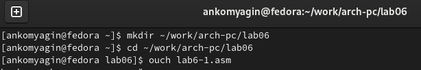{#fig:001 width=80%}

Введем в созданный файл текст из листинга **6.1** (рис. @fig:002).

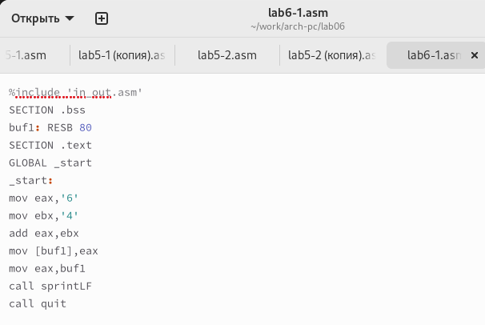{#fig:002 width=80%}

Создадим исполняемый файл и запустим его (рис. @fig:003). Результат его работы - вывод символа **j**.

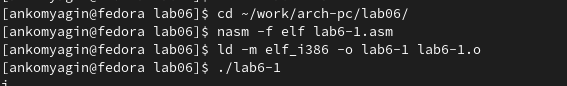{#fig:003 width=80%}

Изменим текст программы (вместо символов запишем в регистры числа) и запустим её (рис. @fig:004). Программа выводит пустой символ (переноса строки).

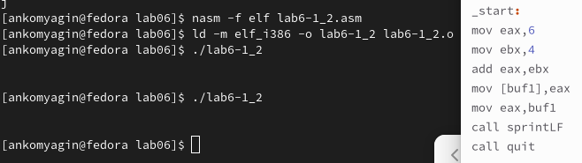{#fig:004 width=80%}

## Программа 6.2

Создадим файл **lab6-2.asm** и введем в него текст программы из листинга **6.2** (рис. @fig:005).

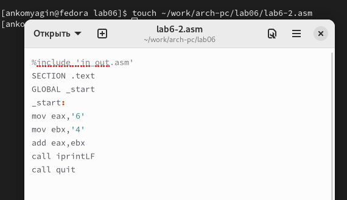{#fig:005 width=80%}

Создадим исполняемый файл и запустим его (рис. @fig:006). Результат работы - число 106

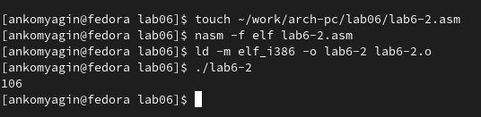{#fig:006 width=80%}

Заменим строки на числа, создадим исполняемый файл и запустим его (рис. @fig:007). Результат работы программы - 10.

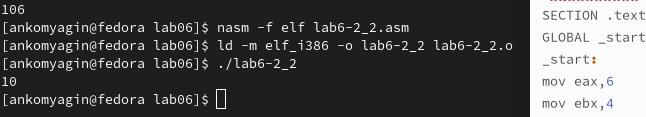{#fig:007 width=80%}

Заменим функцию **iprintLF** на **iprint**. Запустим файл. Разница работы программ и наличии и отсутствии переноса строки (рис. @fig:008).

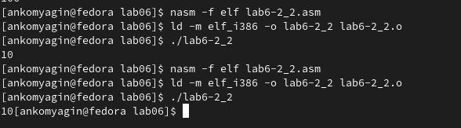{#fig:008 width=80%}

## Программа 6.3

Создадим файл **lab6-3.asm** и заполним его в соответствии с листингом **6.3**. Запустим файл, результат работы изображен на (рис. @fig:009).

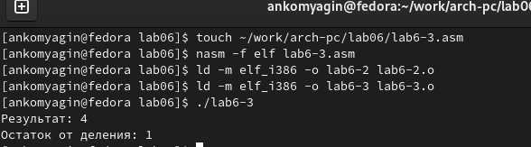{#fig:009 width=80%}

Изменим текст программы для вычисления выражения **𝑓(𝑥) = (4 ∗ 6 + 2)/5** и проверим работоспособность (рис. @fig:010).

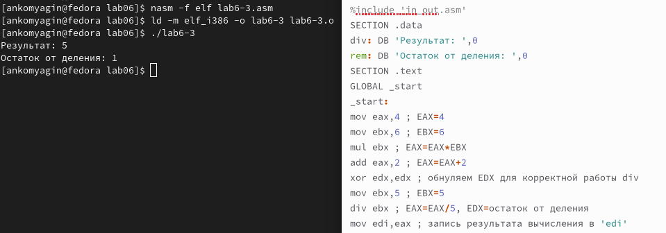{#fig:010 width=80%}

## Программа 6.4

Создадим файл **variant.asm**, заполним его в соответствии с листингом **6.4** (рис. @fig:011).

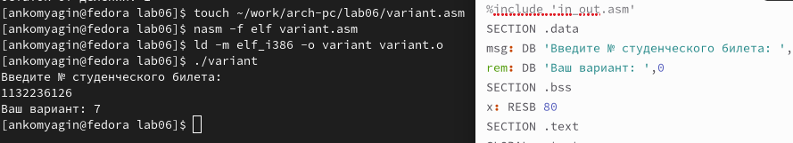{#fig:011 width=80%}

Результат программы - 7. Проверим его аналитически. Для определения остатка деления на 20 достаточно смотреть на 2 последние цифры номера студенческого билета. В моем случае это 26. Остаток деления 26 на 20 = 6, добавляем единицу, которая нужна, чтобы не получился вариант 0, 6+1 = 7.

1. Какие строки листинга 6.4 отвечают за вывод на экран сообщения ‘Ваш вариант:’? **Строки mov eax,rem call sprint**

2. Для чего используется следующие инструкции? mov ecx, x mov edx, 80 call sread. **Для создания переменной х**

3. Для чего используется инструкция “call atoi”?. **Для преобразования кода символа в число**

4. Какие строки листинга 6.4 отвечают за вычисления варианта? **xor edx,edx mov ebx,20 div ebx inc edx**

5. В какой регистр записывается остаток от деления при выполнении инструкции “div ebx”? **в регистр ax**

6. Для чего используется инструкция “inc edx”? **Для добавления единицы**

7. Какие строки листинга 6.4 отвечают за вывод на экран результата вычислений? **mov eax,edx call iprintLF**

## Самостоятельная работа

Написать программу для вычисления значения функции. 

**Вариант 7**. **f(x) = 5(x − 1)^2**. **x1 = 3, x2 = 5**

Программа (рис. @fig:012).

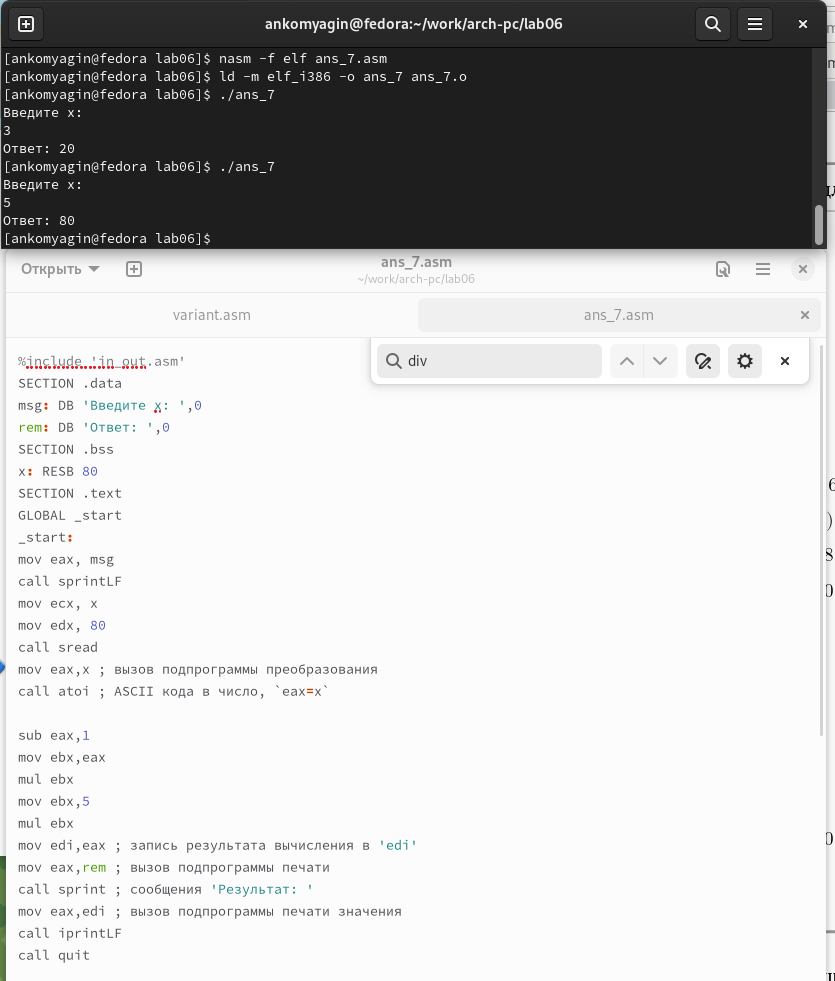{#fig:012 width=90%}

# Выводы

Я ходе работы я освоил арифметические конструкции языка ассемблера NASM. Изучил несколько программ и написал собственную.

