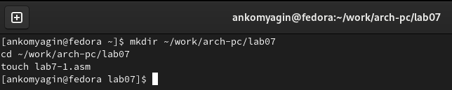
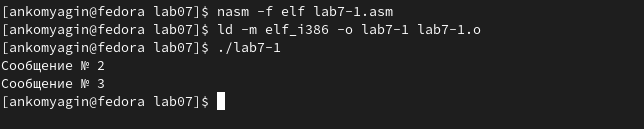
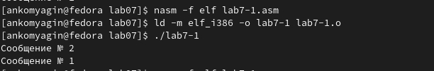
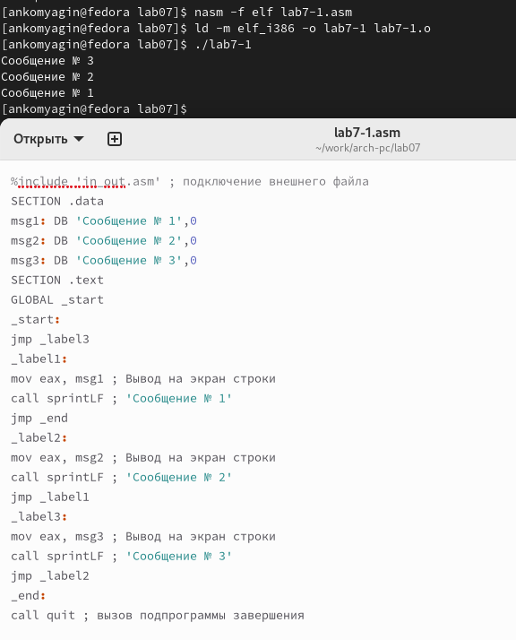
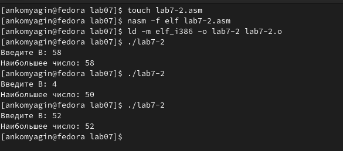
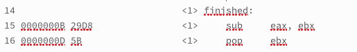
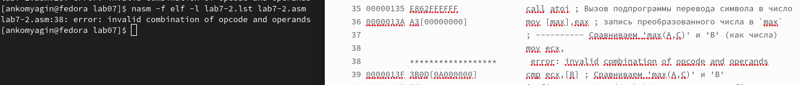
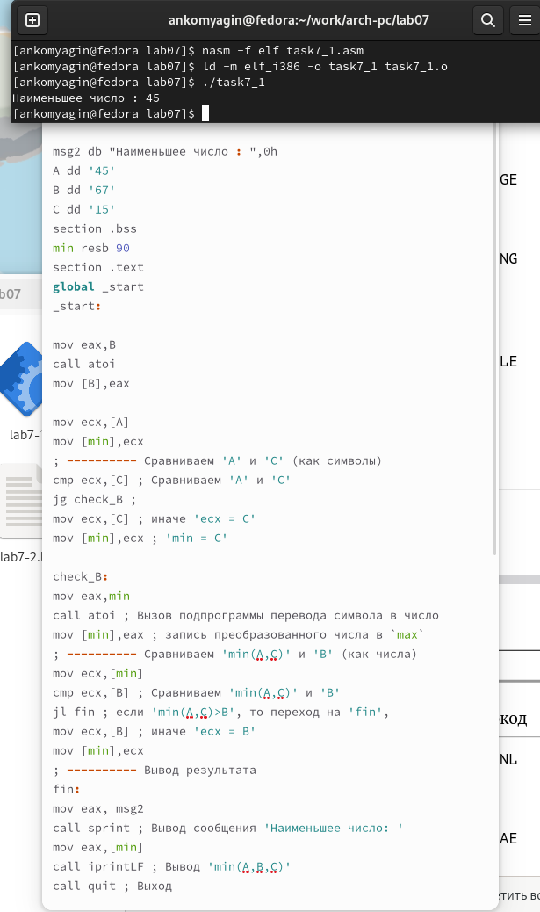
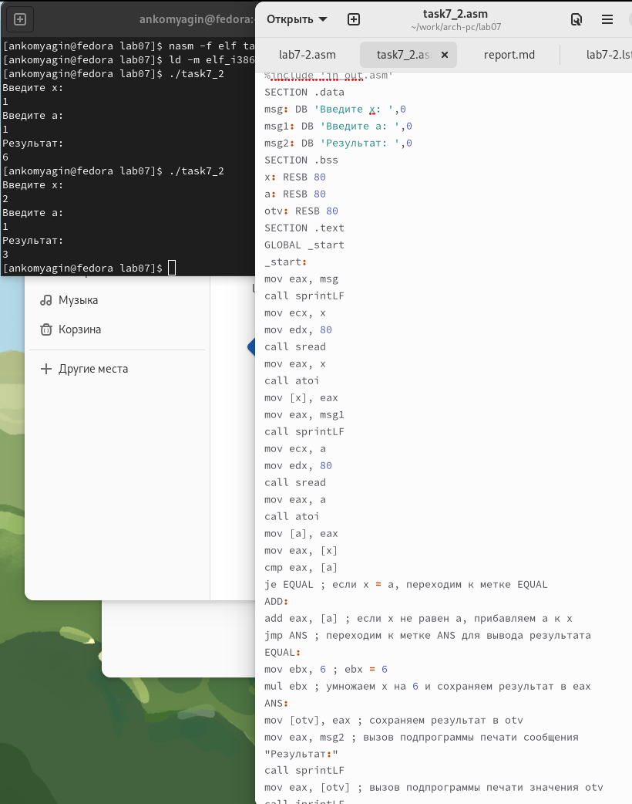

---
## Front matter
title: "Лабораторная работа №7"
subtitle: "Дисциплина: Архитектура компьютера"
author: "Комягин Андрей Николаевич"

## Generic otions
lang: ru-RU
toc-title: "Содержание"

## Bibliography
bibliography: bib/cite.bib
csl: pandoc/csl/gost-r-7-0-5-2008-numeric.csl

## Pdf output format
toc: true # Table of contents
toc-depth: 2
lof: true # List of figures
lot: true # List of tables
fontsize: 12pt
linestretch: 1.5
papersize: a4
documentclass: scrreprt
## I18n polyglossia
polyglossia-lang:
  name: russian
  options:
	- spelling=modern
	- babelshorthands=true
polyglossia-otherlangs:
  name: english
## I18n babel
babel-lang: russian
babel-otherlangs: english
## Fonts
mainfont: PT Serif
romanfont: PT Serif
sansfont: PT Sans
monofont: PT Mono
mainfontoptions: Ligatures=TeX
romanfontoptions: Ligatures=TeX
sansfontoptions: Ligatures=TeX,Scale=MatchLowercase
monofontoptions: Scale=MatchLowercase,Scale=0.9
## Biblatex
biblatex: true
biblio-style: "gost-numeric"
biblatexoptions:
  - parentracker=true
  - backend=biber
  - hyperref=auto
  - language=auto
  - autolang=other*
  - citestyle=gost-numeric
## Pandoc-crossref LaTeX customization
figureTitle: "Рис."
tableTitle: "Таблица"
listingTitle: "Листинг"
lofTitle: "Список иллюстраций"
lotTitle: "Список таблиц"
lolTitle: "Листинги"
## Misc options
indent: true
header-includes:
  - \usepackage{indentfirst}
  - \usepackage{float} # keep figures where there are in the text
  - \floatplacement{figure}{H} # keep figures where there are in the text
---

# Цель работы

Изучить команды условного и безусловного переходов. Приобрести навыки написания программ с использованием переходов. Познакомиться с назначением и структурой файла листинга.

# Выполнение лабораторной работы

Создадим каталог для программ лабораторной работы 7. Создадим в нем файл **lab7-1.asm**(рис. @fig:001).

{#fig:001 width=70%}

Заполним файл в соответствии с листингом **7.1**. Создадим исполняемый файл и запустим его (рис. @fig:002).

{#fig:002 width=70%}

Изменим текст программы в соответствии с листингом **7.2**. Результат работы программы (рис. @fig:003).

{#fig:003 width=70%}

Изменим текст программы так, чтобы вывод программы был в порядке: **сообщение №3 - №2 - №1** (рис. @fig:004).

{#fig:004 width=70%}

Создадим новый файл. Заполним его в соответствии с листингом **7.3** и проверим работу (рис. @fig:005).

{#fig:005 width=70%}

Создадим файл листинга из файла **7-2**. Получить файл листинга можно, указав ключ -l и задав имя файла листинга в командной строке. Ознакомимся с форматом. 

Объясним 3 строки (рис. @fig:006).В строке 14 происходит вычитание значения из регистра eax значения из регистра ebx. Результат вычитания сохраняется в регистре eax. В строке 15 происходит возврат значения из регистра ebx в стек, а в строке 16 это значение используется для выполнения команды pop, которая извлекает значение из стека и помещает его в регистр ebx. 

{#fig:006 width=70%}

Удалим один операнд. Выполним трансляцию и посмотрим результат (рис. @fig:007).

{#fig:007 width=70%}

## Самостоятельная работа

**Вариант 7**

1. Напишем программу для нахождения наименьшей целочисленной переменной. Создадим программу и проверим её работу. Тестовые данные **45,67,15** (рис. @fig:008).

{#fig:008 width=95%}

2. Напишем программу, определяющая значение функции. **f(x) = 6a, при x = a** и **f(x) = a + x, при x != a** (рис. @fig:009).

{#fig:009 width=95%}

# Вывод

В ходе работы я изучил команды условного и безусловного переходов. Приобрел навыки написания программ с использованием переходов. Познакомился с назначением и структурой файла листинга.

